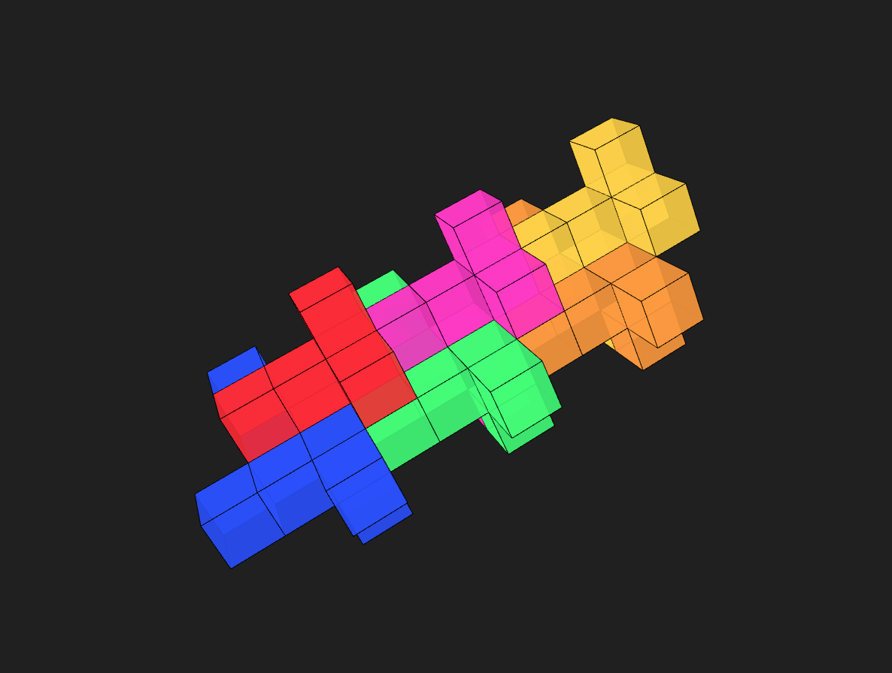
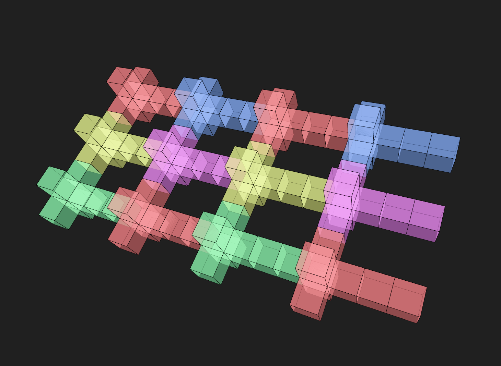
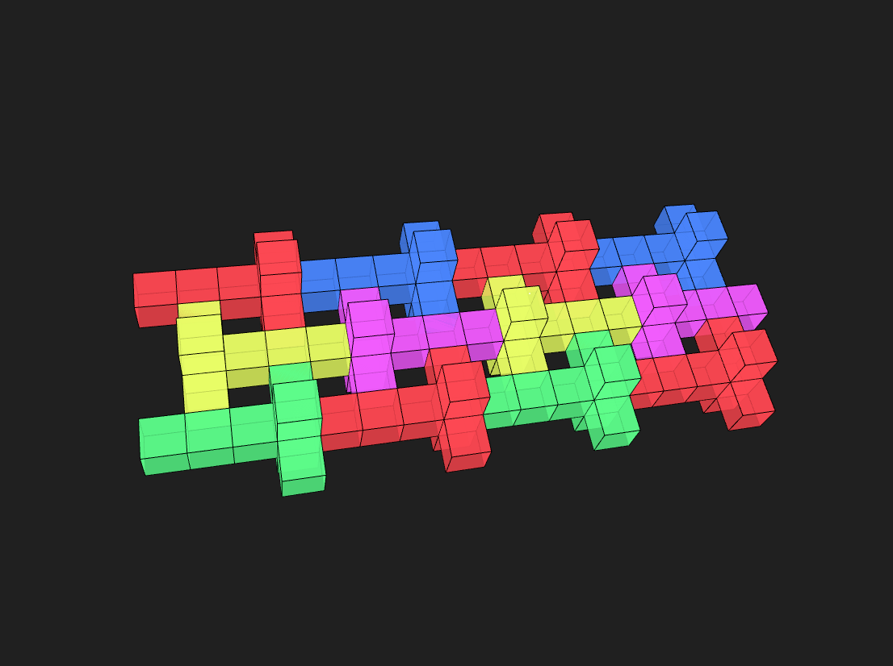
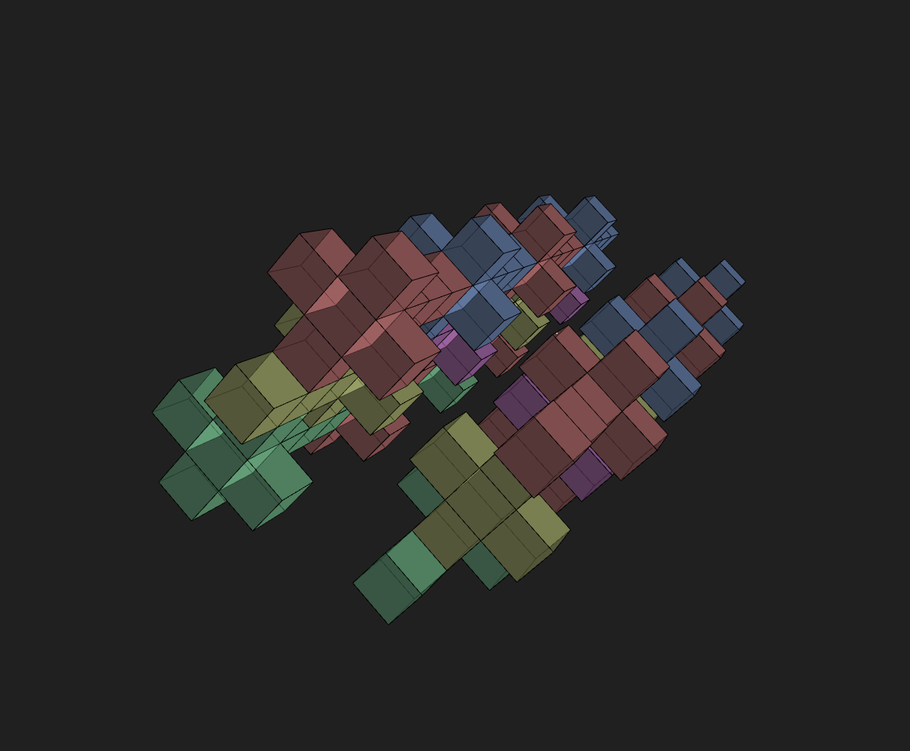
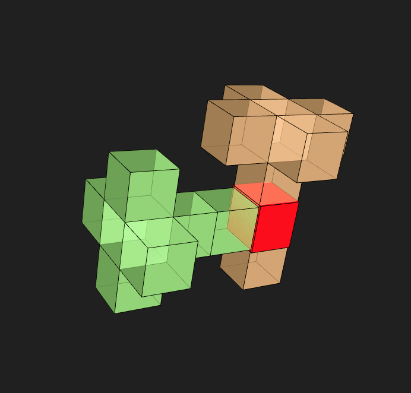
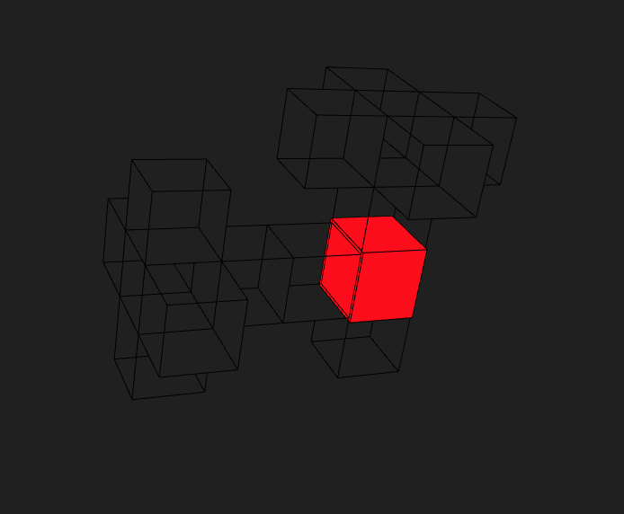

# WHUTS
A tool to facilitate the finding of Which Hypercube Unfoldings Tile Space (WHUTS.org)

Supports adding and removing shapes, moving and rotating a cluster or an individual shape, copying and pasting, and collision detection.

